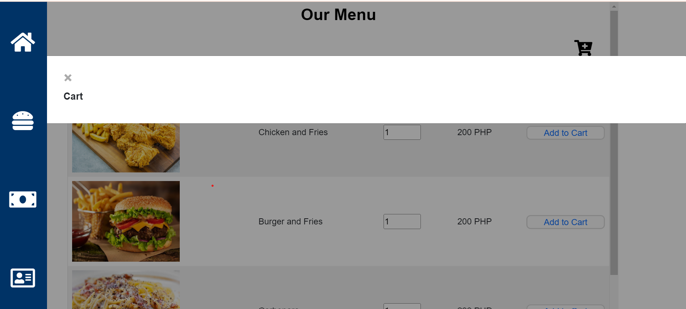
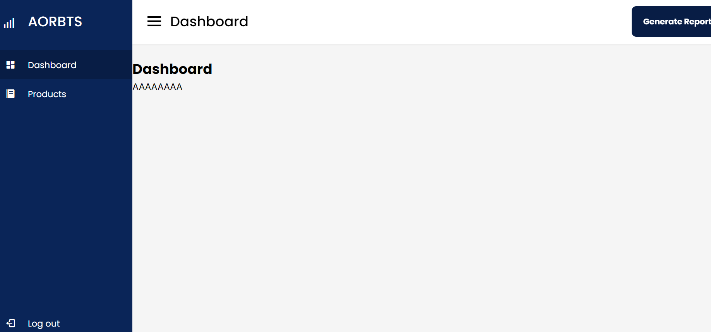

# tracker-repo

Tracker project by Kyle and Chris

##Tools to be used:
-VS Code 

*Basic html and css for designing
-created a login page 

-created a main page (for time in and out)

-created a order section (with cart modal)

cart modal

-created a billing section

-added log out

Goals:
*Design inventory (on-going)
 temporary