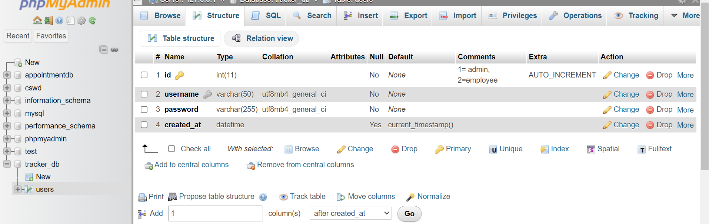
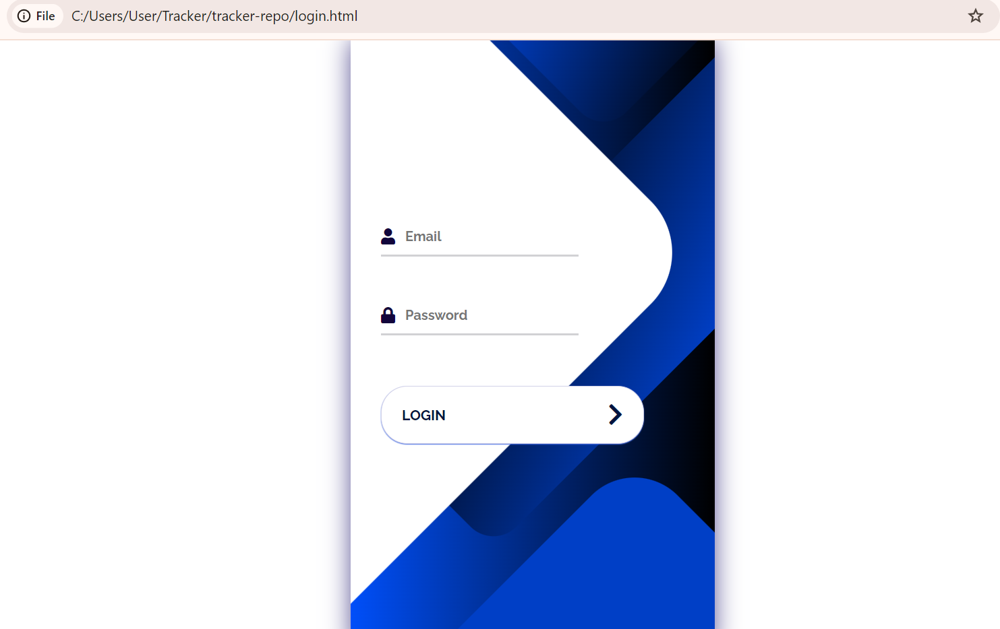
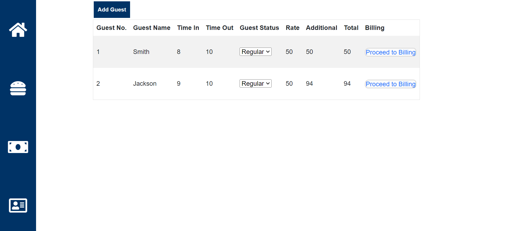
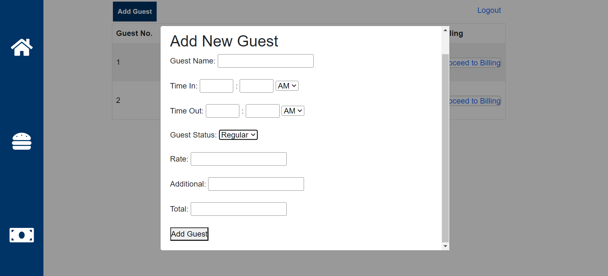
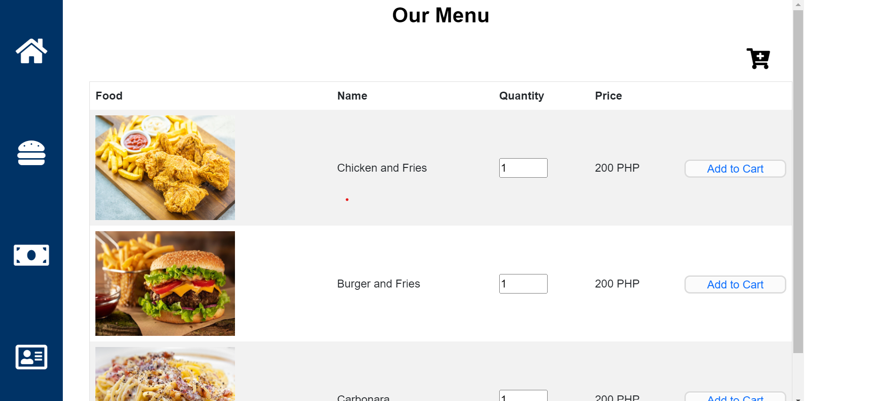
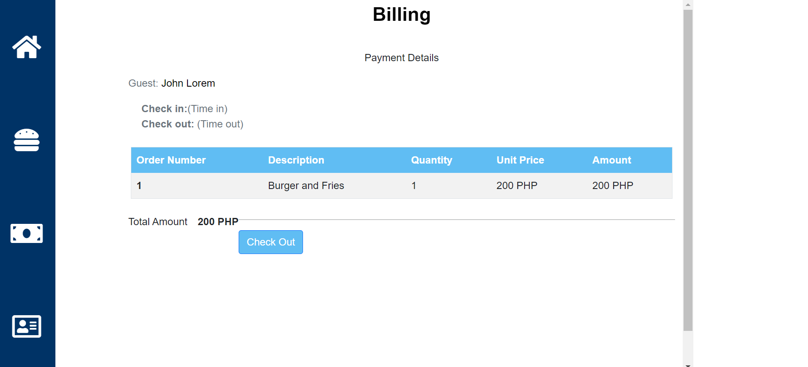
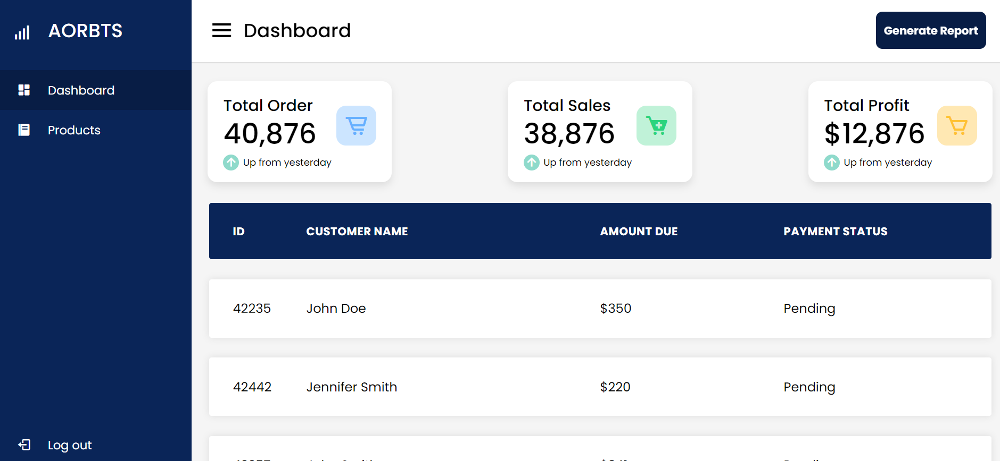
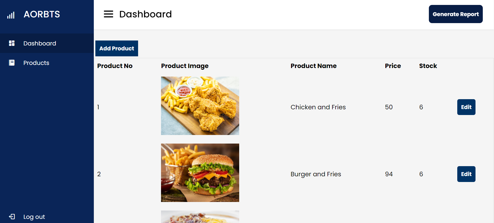
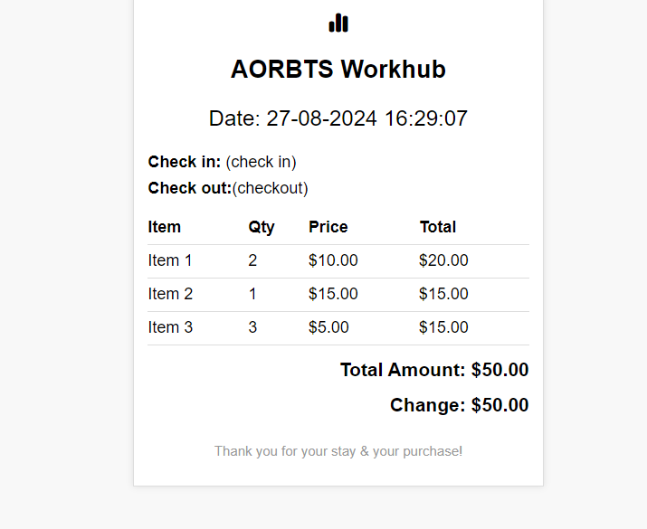

# tracker-repo

Tracker project by Kyle and Chris

##Tools to be used:
-Xammp
created a database (will add more)

NOTE:login functionality is working so far
-VS Code 

*Basic html and css for designing
-created a login page 

-created a main page (for time in and out)

-created a modal for add guest (will be redesign in the future)

-created a order section (with cart modal)

cart modal (not working anymore)

-created a billing section

-added log out

Goals:
*Design dashboard (on-going)

*design product section

*Design for receipt (on-going)
